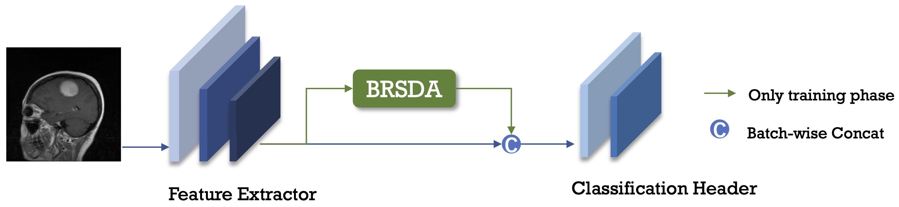
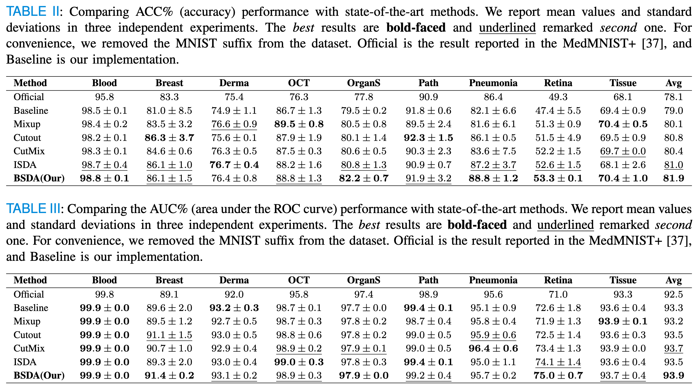

# BSDA

Bayesian Random Semantic Data Augmentation (BSDA)  algorithm implement in Pytorch。

* [BSDA: Bayesian Random Semantic Data Augmentation for Medical Image Classification](https://arxiv.org/abs/2403.06138)


## Introduction



## Get Started

### Run
```
python train_bsda.py --resize --bsda --bsda_lambda 0.8  --bsda_multi 10 --bsda_use_ori  --bsda_alpha 0.5 --model_name resnet18 
```

### Result


## How to use our method
```
from networks.bsda_warp import BSDAWarp

model = Backbone()
bsda_warp = BSDAWarp(model, num_classes, multi=10, lambda=0.8)

...
# Training
outputs = bsda_warp(x, is_train=True) 
loss = bsda_warp.get_loss(outputs, targets, criterion, is_train=True)

# forward loss
...
```

## Acknowledgment

* Our code for classification is mainly based on [MedMNIST](https://github.com/MedMNIST/MedMNIST)
* Our code for augmentation method if maily based on [ISDA](https://github.com/blackfeather-wang/ISDA-for-Deep-Networks)

## Citation
```
@article{zhu2024bayesian,
  title={Bayesian Random Semantic Data Augmentation for Medical Image Classification},
  author={Zhu, Yaoyao and Cai, Xiuding and Wang, Xueyao and Yao, Yu},
  journal={arXiv preprint arXiv:2403.06138},
  year={2024}
}
```
